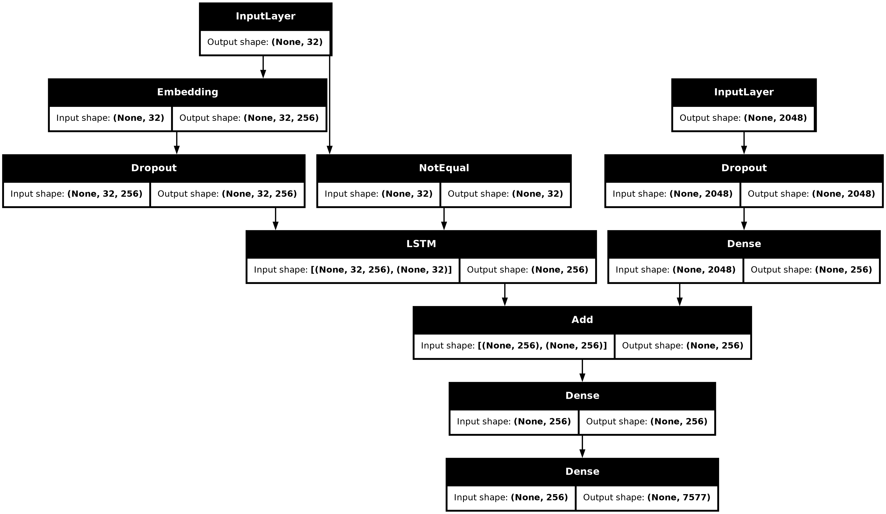

# Image-Caption-Generator

Simple image captioning project using PyTorch. This repo includes dataset preprocessing, an encoder-decoder model, training/evaluation scripts, and example inference.

## Quick start
1. Create venv:
   ```bash
   python -m venv .venv
   source .venv/bin/activate
   pip install -r requirements.txt
   ```


## 📝 Description

Unleash the power of AI to breathe life into your images with Image-Caption-Generator! This Python-based project leverages cutting-edge techniques to automatically generate descriptive and engaging captions for any image you throw its way. While details about specific features are currently limited, the foundation in Python promises a versatile and extensible platform for future development. Imagine effortlessly captioning your photo albums, automating social media posts, or enhancing accessibility for visually impaired users. Image-Caption-Generator is the starting point for exploring the exciting intersection of computer vision and natural language processing.


## 📦 Key Dependencies

```
tensorflow: 2.15.0
keras: 2.15.0
numpy: 1.24.3
Pillow: 10.0.0
matplotlib: 3.7.2
tqdm: 4.66.1
```

## 📁 Project Structure

```
Image-Caption-Generator/
├─ LICENSE
├─ main.py
├─ .gitignore     
├─ README.md
├─ requirements.txt
├─ .gitignore
└── test.py
```

## Model Structure


## 🛠️ Development Setup

### Python Setup
1. Install Python (v3.8+ recommended)
2. Create a virtual environment: `python -m venv venv`
3. Activate the environment:
   - Windows: `venv\Scripts\activate`
   - Unix/MacOS: `source venv/bin/activate`
4. Install dependencies: `pip install -r requirements.txt`


## 👥 Contributing

Contributions are welcome! Here's how you can help:

1. **Fork** the repository
2. **Clone** your fork: `git clone https://github.com/Siddhant-Pragyan-Sinha/Image-Caption-Generator.git`
3. **Create** a new branch: `git checkout -b feature/your-feature`
4. **Commit** your changes: `git commit -am 'Add some feature'`
5. **Push** to your branch: `git push origin feature/your-feature`
6. **Open** a pull request

Please ensure your code follows the project's style guidelines and includes tests where applicable.

## License
[MIT](/License)

---